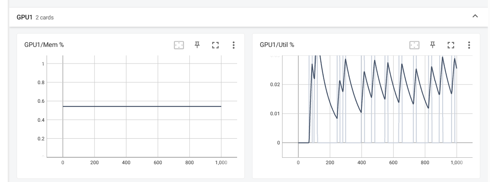

# Remote-GPU-monitoring-tool
Help u monitoring GPU with a simple python script 

## version 0.0.0 

this is a really simple script now. 

Hopefully further needs will be discovered and more functions will be implemented. 

## Quick Start 

### install requirements

```
pip install -r req.txt 
```

### run monitor.py on local machine

specify your parameters 

```
python monitor.py --server_ip "your_server_ip" --username "your_username" --password "your_password" --verbose 1 --logdir "./your_logs_directory" --gpu_id 0,1
```

### visualize with tensorboard

```
tensorboard --logdir="./your_logs_directory"
```


